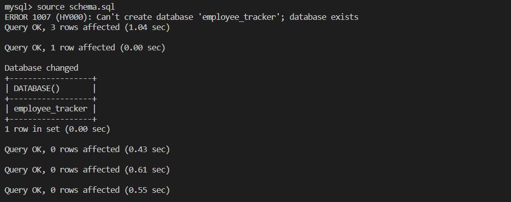

# uofa-module12-sqlemployeetracker-lsandura
SQL Challenge: Employee Tracker Bootcamp Module completed by Laura Sandura

Main Objective: 
To build a command-line application from scratch to manage a company's employee database, using Node.js, Inquirer, and MySQL2 so that a business owner can view and manage departments, roles and employees.

Challenge: 
GIVEN a command-line application that accepts user input
WHEN I start the application
THEN I am presented with the following options: view all departments, view all roles, view all employees, add a department, add a role, add an employee, and update an employee role
WHEN I choose to view all departments
THEN I am presented with a formatted table showing department names and department ids
WHEN I choose to view all roles
THEN I am presented with the job title, role id, the department that role belongs to, and the salary for that role
WHEN I choose to view all employees
THEN I am presented with a formatted table showing employee data, including employee ids, first names, last names, job titles, departments, salaries, and managers that the employees report to
WHEN I choose to add a department
THEN I am prompted to enter the name of the department and that department is added to the database
WHEN I choose to add a role
THEN I am prompted to enter the name, salary, and department for the role and that role is added to the database
WHEN I choose to add an employee
THEN I am prompted to enter the employee’s first name, last name, role, and manager, and that employee is added to the database
WHEN I choose to update an employee role
THEN I am prompted to select an employee to update and their new role and this information is updated in the database

Additional Expectations:
    be mindful of protecting passwords (mayb use gitignore for sql pw)
    might want to use seeds.sql

Bonuses:
    Extra points for adding options for update employee managers. View employees by manager. View employees by department. Delete departments, roles, and employees. View the total utilized budget of a department—in other words, the combined salaries of all employees in that department.

Assignment Example 1 Picture:    
    

Git Repository link where finalzed project can be pulled:
    [Git Repo](https://github.com/laurabora118/uofa-module12-sqlemployeetracker-lsandura)  

Git Page that shows finalized project results: 
(only read me if page is not applicable for assignment)
    [Git Page](https://laurabora118.github.io/uofa-module12-sqlemployeetracker-lsandura/)  

How to use, run or deploy a clone:
    This project requires the following was installed: mysql2, inquirer, node.
    npm install --save mysql2
    npm i inquirer@8.2.4
    npm install console.table --save
    bower install console.table --save
    After clone repo, must mysql and source

Video link of working app deployed: (if applicable)
    [Video](https://watch.screencastify.com/v/QqfjID9QAKmivwPmeKhm)  

References:
    1 - Assignment criteria received in UofA assignments

